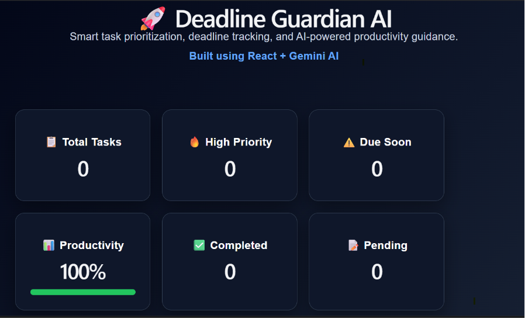
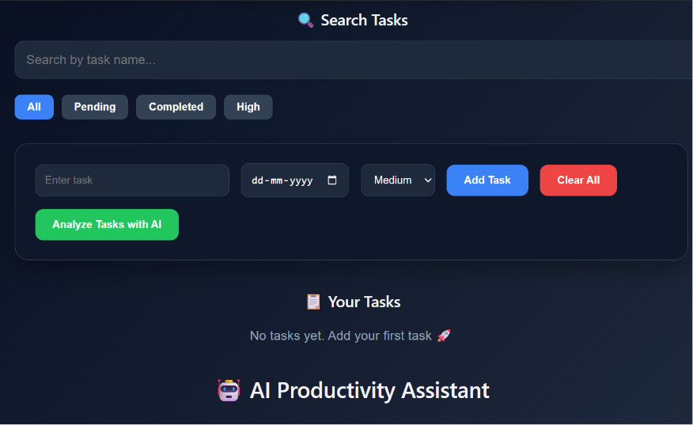

# 🚀 Deadline Guardian AI

An AI-powered productivity web app that helps users manage tasks, track deadlines, and get smart AI-driven suggestions to improve productivity and avoid missing important deadlines.

---

## ✨ Features

- 📌 Add, manage, and track tasks easily
- ⏰ Deadline tracking system
- 🤖 AI-powered suggestions using Google Generative AI
- 📊 Smart task dashboard
- ⚡ Fast and responsive UI built with React + Vite
- 🌐 Deployed for real-world usage

---

## 🛠️ Tech Stack

- React.js
- Vite
- JavaScript (ES6+)
- CSS
- Google Generative AI API
- Node.js (for tooling)

---

## 🧠 AI Integration

This project uses **Google Generative AI (@google/generative-ai)** to:
- Generate productivity tips
- Suggest task prioritization
- Help users manage workload efficiently

---

## 📸 Screenshots

> Add your screenshots here

Example:
```md


---

## 🛠 Tech Stack
- React.js
- Vite
- JavaScript
- Google Generative AI
- CSS

---

## 🌐 Live Demo
https://your-vercel-link.vercel.app

---

## 👩‍💻 Author
Aastha Tiwari
GitHub: https://github.com/aasthaatiwarii